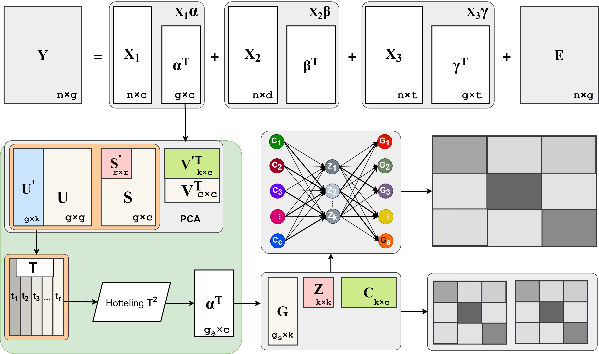

<!-- README.md is generated from README.Rmd. Please edit that file -->

# alva

<!-- badges: start -->

[](https://cran.r-project.org/package=dplyr)
[](https://github.com/tidyverse/dplyr/actions/workflows/R-CMD-check.yaml)
[](https://app.codecov.io/gh/tidyverse/dplyr?branch=main)
<!-- badges: end -->

## Overview

**alva** is an R package for identifying drug-target interaction genes using perturbation data.

Workflow of ALVA in five main steps:


## Installation

``` r
# Install released version from CRAN
install.packages("alva")
```

To get a bug fix or to use a feature from the development version, you
can install the development version of toxassay from GitHub.

``` r
# install.packages("pak")
pak::pak("FanLiuLab/alva")
```

## Getting help

If you encounter a clear bug, please file an issue with a minimal
reproducible example on
[GitHub](https://github.com/ringku09/toxassay/issues). For questions and
other discussion, please send an [E-mail](mailto:ringku_740@yahoo.com).
